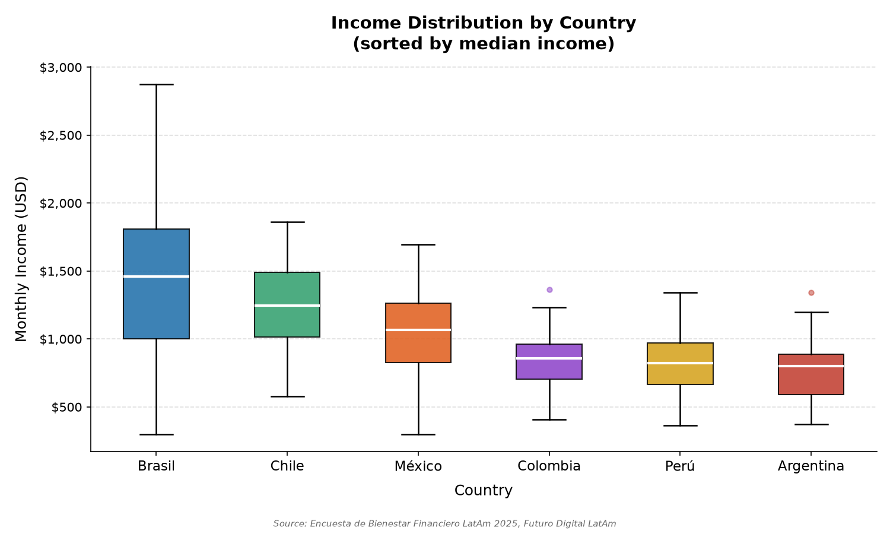
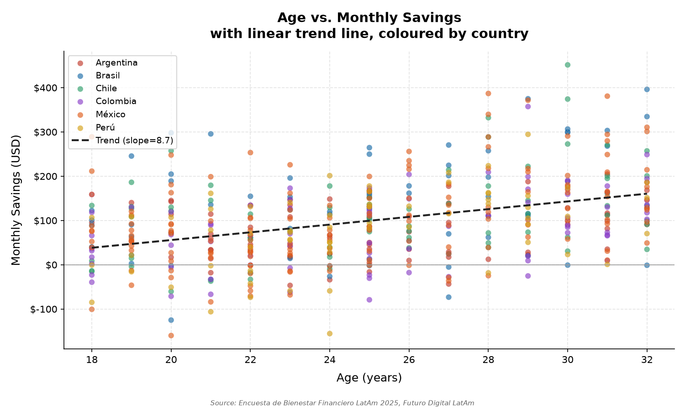
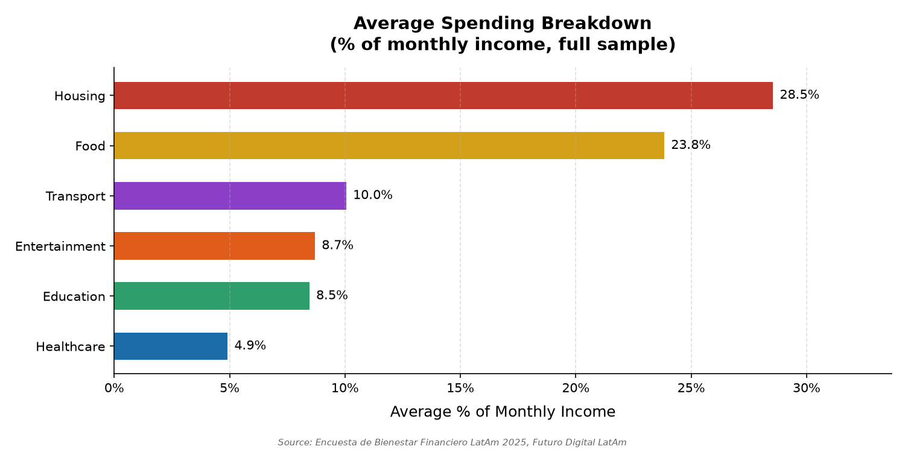
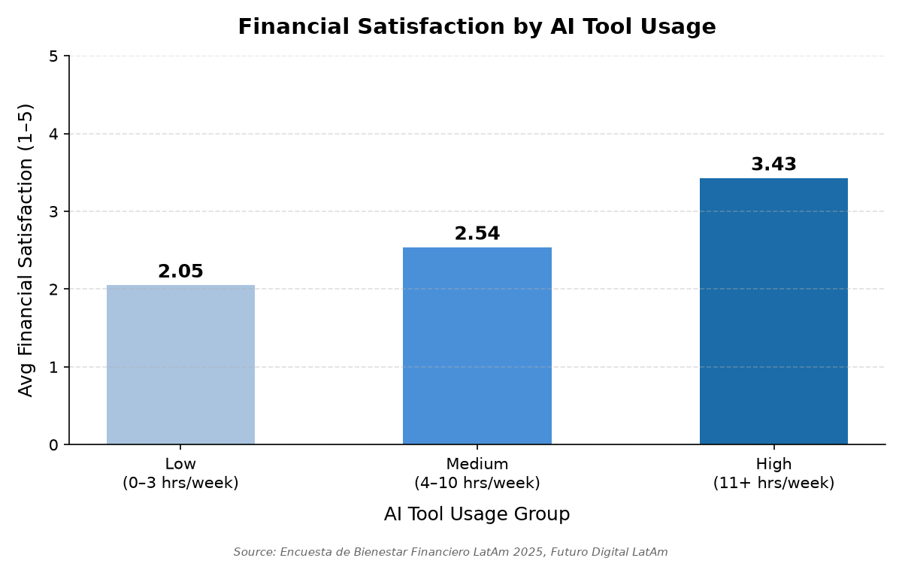
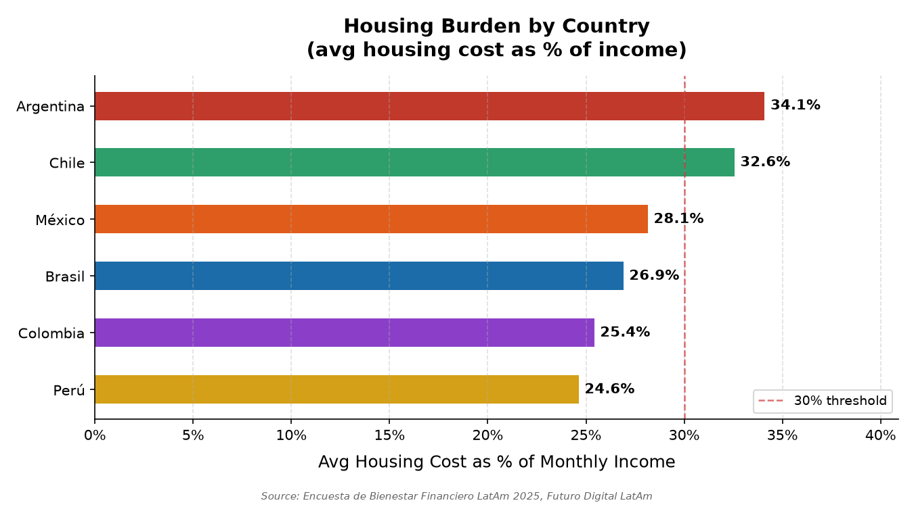

# Datos que Hablan: Bienestar Financiero de Jóvenes Profesionales en América Latina
## Informe Ejecutivo — Futuro Digital LatAm, 2025

*Based on the Encuesta de Bienestar Financiero LatAm 2025. Survey of 500 young professionals (ages 18–32) across six countries: México, Colombia, Argentina, Chile, Perú, and Brasil.*

---

## 1. Executive Summary

This report analyses the financial wellbeing of 500 young professionals across Latin America. Three findings stand out as most consequential for programme design. First, **income inequality across countries is severe**: median monthly income ranges from **USD 798 in Argentina to USD 1,458 in Brazil** — an 83% gap that makes any regional one-size-fits-all curriculum inadequate. Second, **housing and food together consume 52.3% of average monthly income**, leaving the majority of respondents with little structural capacity to save, invest, or absorb unexpected expenses — this is a constraint no amount of budgeting advice alone will fix. Third, **the youngest participants (18–22) save only USD 61 per month at a rate of 5.7% of income**, compared to USD 154 and 15.5% for the 29–32 group — a gap that compounds over time and leaves younger cohorts particularly exposed to financial shocks.

Two recommendations follow directly from the data. Programmes should be **localised by country income tier**, with distinct content tracks for higher-income markets (Brazil, Chile) versus lower-income ones (Argentina, Colombia, Perú). And programmes should invest in **targeted early-career savings modules** for participants under 23, where the intervention potential is highest and current outcomes are lowest.

---

## 2. Methodology

**Dataset:** Encuesta de Bienestar Financiero LatAm 2025, collected by Futuro Digital LatAm.

**Sample:** 500 respondents across 6 countries — México (n=150), Colombia (n=80), Argentina (n=70), Chile (n=70), Perú (n=65), Brasil (n=65). All respondents are young professionals aged 18–32.

**Variables collected:** Demographics (country, age, occupation, industry), monthly income, six spending categories (housing, food, transport, entertainment, education, healthcare), monthly savings, debt balance, credit and savings account ownership, primary financial goal, weekly AI tool usage hours, and self-reported financial satisfaction (scale 1–5).

**Data processing:** The raw dataset (`data/latam_finanzas_2025.csv`) underwent structured cleaning before analysis:

| Issue Found | Resolution | Rows Affected |
|-------------|------------|:-------------:|
| `industria` column: three non-standard spellings of "Tecnología" (`Tecnologia`, `tech`, `TECNOLOGÍA`) | Standardized all variants to `Tecnología` | 10 |
| `gasto_salud_usd`: 33 missing values (6.6% of sample) | Imputed with column median (USD 45.66); median preferred over mean to limit outlier sensitivity | 33 |
| `ahorro_mensual_usd`: 74 negative values indicating spending exceeds income | Values retained as valid data; a boolean flag column (`ahorro_negativo`) created for downstream analysis | 74 |

The cleaned dataset was saved to `data/latam_finanzas_clean.csv` (500 rows, 22 columns) and used for all analyses in this report.

### Pipeline Architecture

This Final Capstone builds on the Midterm II analysis by turning it into a repeatable, automated pipeline with four components:

- **Hooks** (`.claude/settings.json`): a *chart counter* hook prints progress toward the 5 required charts each time one is saved to `charts/`; a *script logger* hook appends a timestamped entry to `session-log.md` after every Bash command Claude Code runs; a *phase validator* hook (`.claude/hooks/validate-phases.sh`) checks whether the expected output for each phase exists — clean dataset, country-profiler agent, analysis script, 5 charts, executive report, session log, and both skills.
- **Skills** (`.claude/skills/`): `/interpret` produces a consistent 3-sentence policy-facing interpretation (fact → implication → recommendation) for each statistical finding; `/publish-finding` prepares and publishes a finding to the Notion Findings Tracker database, with a local fallback in `notion_exports/` if Notion MCP is unavailable.
- **Country Profiler Agent** (`.claude/agents/country-profiler.md`): generates a standardized statistical profile — sample size, age range, income distribution, housing burden, spending breakdown, savings, AI usage, and financial satisfaction — for each of the six countries, saved to `scripts/country_[name].py` and compiled in `scripts/country_profiles.md`.
- **Notion MCP**: publishes the six country profiles to the "Country Profiles" database, the six findings (with a key-statistic callout, interpretation, and "Next steps") to the "Findings Tracker" database, and this executive report to the "Informe Ejecutivo" page — making the pipeline's output reusable and shareable beyond the local repository.

---

## 3. Sample Profile

The survey captures **500 young professionals** between the ages of 18 and 32, with a mean age of **25.0 years** (std dev 4.2). The age distribution is roughly uniform across the range, with the median at exactly 25 years and the interquartile range spanning ages 22 to 29.

**Country representation** reflects a deliberately over-sampled Mexican cohort, which at n=150 accounts for 30% of the full sample, followed by Colombia (16%), Argentina and Chile (14% each), and Perú and Brasil (13% each).

| Country | n | Share |
|---------|--:|------:|
| México | 150 | 30.0% |
| Colombia | 80 | 16.0% |
| Argentina | 70 | 14.0% |
| Chile | 70 | 14.0% |
| Perú | 65 | 13.0% |
| Brasil | 65 | 13.0% |
| **Total** | **500** | **100%** |

**Industry distribution** spans 10 standardised sectors after cleaning. The top five are Finance (66 respondents, 13.2%), Technology (57, 11.4%), Engineering (53, 10.6%), Sales (51, 10.2%), and Health (49, 9.8%). No single industry dominates, providing a reasonably diverse occupational picture.

**Occupations** are spread across 10 roles. The most represented are Graphic Designer (56), Engineer (55), Community Manager (52), Project Manager (51), and Accountant (50) — suggesting a sample weighted toward knowledge-economy and service-sector workers rather than manual or agricultural labour.

**Financial profile of the sample:**
- **56.8%** hold a credit card (284 respondents)
- **72.4%** have a savings account (362 respondents)
- **46.8%** currently carry debt (234 respondents)
- The three most common financial goals are: paying off debt (81 respondents, 16.2%), investing in the stock market (75, 15.0%), and saving for retirement (68, 13.6%)

---

## 4. Findings

### 4.1 Income Varies by up to 83% Across Countries

Median monthly income across the six countries ranges from **USD 798 in Argentina** to **USD 1,458 in Brazil**. Chile (USD 1,246) and México (USD 1,067) occupy a middle tier, while Colombia (USD 857) and Perú (USD 822) cluster near Argentina at the lower end. Brazil also shows the widest income dispersion (std dev USD 592), suggesting significant internal inequality — its minimum of USD 300 is the same as México's, while its maximum of USD 2,875 is the highest in the sample.

| Country | Median (USD) | Mean (USD) | Min (USD) | Max (USD) | Std Dev |
|---------|------------:|----------:|----------:|----------:|--------:|
| Brasil | 1,458.03 | 1,387.97 | 300.00 | 2,874.49 | 592.18 |
| Chile | 1,246.01 | 1,245.29 | 575.20 | 1,861.10 | 289.66 |
| México | 1,066.99 | 1,042.05 | 300.00 | 1,693.16 | 286.61 |
| Colombia | 856.62 | 848.78 | 405.15 | 1,362.79 | 188.70 |
| Perú | 821.59 | 817.76 | 361.89 | 1,341.50 | 207.91 |
| Argentina | 798.49 | 766.38 | 372.85 | 1,342.56 | 203.94 |

These income gaps are not cosmetic: a savings target or investment threshold calibrated for Brazil will be structurally unachievable for most Argentine or Colombian participants. Programmes that apply uniform financial benchmarks across the region risk setting goals that demotivate rather than inspire. *(See Figure 1)*

> **Policy Interpretation (via `/interpret` skill):** Median monthly income ranges from USD 798 in Argentina to USD 1,458 in Brazil, an 83% gap between the lowest- and highest-earning countries in the sample. This disparity means a single regional financial curriculum would be unattainable for participants in Argentina, Colombia, and Perú, while offering too little challenge for those in Brazil and Chile. Futuro Digital LatAm should build two income-tier content tracks: one focused on emergency funds and debt management for lower-income countries, and another on investing and wealth-building for higher-income countries.

*Figure 1: Box plot of monthly income (USD) by country, sorted by median. Brazil's wide interquartile range reflects substantially greater income dispersion than other markets.*

---

### 4.2 Savings Behaviour Improves Significantly With Age — But the Youngest Cohort Is at Risk

Average monthly savings and savings rate both increase steadily across age groups, but the gap between the youngest and oldest cohorts is striking.

| Age Group | n | Avg Monthly Savings (USD) | Avg Savings Rate (%) |
|-----------|--:|-------------------------:|---------------------:|
| 18–22 | 162 | 60.80 | 5.7% |
| 23–25 | 123 | 76.48 | 8.3% |
| 26–28 | 87 | 120.98 | 11.7% |
| 29–32 | 128 | 154.07 | 15.5% |

The **18–22 cohort saves USD 61/month at a 5.7% rate** — less than half the savings rate of the oldest group. At this pace, a respondent aged 18 earning the sample median would take more than two years to accumulate a single month's income as an emergency buffer. The steepest relative improvement occurs between the 23–25 and 26–28 groups (from 8.3% to 11.7%), suggesting this is a critical window for intervention. The trend line across all ages has a positive slope of USD 8.7 per additional year of age. *(See Figure 2)*

> **Policy Interpretation (via `/interpret` skill):** The 18–22 age group saves only USD 61 per month (5.7% of income), compared to USD 154 per month (15.5%) for the 29–32 group. This gap leaves the youngest professionals significantly more exposed to financial shocks, since at this pace it would take more than two years to accumulate a single month's income as an emergency buffer. Futuro Digital LatAm should launch a savings module targeted at participants under 23, built around small automated transfers and a "first emergency fund" milestone rather than a fixed dollar target unrealistic at entry-level income.

*Figure 2: Scatter plot of age vs. monthly savings (USD) with linear trend line (slope = 8.7). Points coloured by country. Negative savings values are shown below the zero line.*

---

### 4.3 Housing and Food Absorb More Than Half of Every Pay Cheque

Across the full sample of 500 respondents, **housing (28.5%) and food (23.8%) together account for 52.3% of average monthly income**, leaving only 47.7% to cover transport, education, entertainment, healthcare, savings, and debt repayment simultaneously.

| Category | Avg % of Income | Avg USD/month |
|----------|---------------:|-------------:|
| Housing | 28.5% | 290.32 |
| Food | 23.8% | 242.61 |
| Transport | 10.0% | 102.19 |
| Entertainment | 8.7% | 88.56 |
| Education | 8.5% | 82.18 |
| Healthcare | 4.9% | 49.60 |

Healthcare at **4.9% of income** — the lowest category tracked — is a particularly notable data point. For a cohort earning an average of USD 1,017/month, this amounts to roughly USD 50/month, a figure more likely to reflect foregone care than adequate coverage. Meanwhile, education (8.5%) and entertainment (8.7%) are virtually identical and already modest: there is little discretionary slack to compress. *(See Figure 3)*

> **Policy Interpretation (via `/interpret` skill):** Housing (28.5%) and food (23.8%) together account for 52.3% of average monthly income across the 500 respondents, leaving less than half of income for everything else. This means traditional advice to cut entertainment (8.7%) or education (8.5%) spending will have minimal financial impact for the sample as a whole, since those categories are already modest and are not the real bottleneck. Futuro Digital LatAm's budgeting content should instead focus on housing-cost renegotiation strategies and food-budget planning rather than marginal cuts to already-small categories.

*Figure 3: Average percentage of monthly income spent across six expense categories (full sample, n=500). Sorted from highest to lowest.*

---

### 4.4 Credit Card Holders Spend More Freely — and Still Save More

The **284 credit card holders** (56.8% of the sample) and **216 non-holders** (43.2%) have nearly identical incomes — card holders earn just 1.5% more on average (USD 1,023 vs. USD 1,008). Yet the behavioural differences are meaningful:

| Metric | Has Card (n=284) | No Card (n=216) | % Difference |
|--------|----------------:|----------------:|:------------:|
| Avg Monthly Income (USD) | 1,023.35 | 1,008.18 | +1.5% |
| Avg Food Spending (USD) | 258.05 | 222.30 | **+16.1%** |
| Avg Entertainment (USD) | 94.56 | 80.67 | **+17.2%** |
| Avg Monthly Savings (USD) | 101.75 | 95.39 | +6.7% |

Card holders spend 16.1% more on food and 17.2% more on entertainment, yet still save 6.7% more per month. This suggests that credit cards are not simply a mechanism for overspending — card holders appear to be slightly more financially engaged overall. The risk lies in the 46.8% of the total sample who carry existing debt: a card-enabled spending pattern layered on top of outstanding balances represents the highest-risk financial profile in the dataset.

> **Policy Interpretation (via `/interpret` skill):** Credit card holders (56.8% of the sample) spend 16.1% more on food and 17.2% more on entertainment than non-holders, yet still save 6.7% more per month, despite having nearly identical incomes (+1.5%). This shows that credit card ownership is not itself the cause of poor financial behaviour, and that the real risk is concentrated among the 46.8% of respondents who also carry existing debt. Futuro Digital LatAm should refocus its credit card curriculum on the active-debt segment, teaching how compound interest accrues, the true cost of carrying a balance, and debt repayment prioritization.

---

### 4.5 AI Tool Usage Is Strongly Correlated With Financial Satisfaction — Income Is a Confounding Factor

Respondents are grouped into three AI tool usage tiers based on reported hours per week. The differences in financial satisfaction are substantial:

| AI Usage Group | n | Avg Satisfaction (1–5) | Avg Income (USD) |
|----------------|--:|----------------------:|----------------:|
| Low (0–3 hrs/week) | 98 | 2.05 | 746.75 |
| Medium (4–10 hrs/week) | 381 | 2.54 | 1,045.83 |
| High (11+ hrs/week) | 21 | 3.43 | 1,750.29 |

The Pearson correlation between weekly AI tool hours and financial satisfaction score is **r = 0.57 (p < 0.0001)** — a moderately strong, statistically significant relationship. However, high AI users earn more than **twice as much on average** as low users (USD 1,750 vs. USD 747). Income is a substantial confounding variable: the data establishes a meaningful association but cannot establish that AI tool usage *causes* greater financial satisfaction. What it does confirm is that digitally active participants are disproportionately higher earners who use technology as part of a broader financially engaged lifestyle. *(See Figure 4)*

> **Policy Interpretation (via `/interpret` skill):** There is a statistically significant positive correlation (r=0.57, p<0.0001) between weekly AI tool usage hours and financial satisfaction, with the high-usage group (11+ hours) reporting an average satisfaction of 3.43 versus 2.05 for the low-usage group (0–3 hours). However, high-usage respondents earn more than twice as much on average as low-usage respondents (USD 1,750 vs. USD 747), making income a substantial confounding factor and meaning AI usage cannot be said to cause higher financial satisfaction. Futuro Digital LatAm should incorporate AI tools as an engagement channel across all income levels within the programme, evaluating satisfaction impact while controlling for income rather than attributing the gain to technology use alone.

*Figure 4: Average financial satisfaction score (1–5 scale) by AI tool usage group. Low users (0–3 hrs/week) report a mean score of 2.05 vs. 3.43 for high users (11+ hrs/week).*

---

### 4.6 Housing Costs Are a Structural Crisis in Argentina and Chile

Two countries exceed the internationally recognised **30% housing affordability threshold**:

| Country | Avg Housing % of Income | Avg Housing (USD) | Avg Income (USD) |
|---------|------------------------:|------------------:|----------------:|
| Argentina | **34.1%** | 258.33 | 766.38 |
| Chile | **32.6%** | 407.25 | 1,245.29 |
| México | 28.1% | 291.36 | 1,042.05 |
| Brasil | 26.9% | 377.05 | 1,387.97 |
| Colombia | 25.4% | 216.02 | 848.78 |
| Perú | 24.6% | 201.14 | 817.76 |

Argentina's situation is particularly acute: it has the **lowest median income in the sample (USD 798)** yet the **highest housing burden (34.1%)**. Chilean participants pay more in absolute terms (USD 407/month vs. Argentina's USD 258) but do so against a substantially higher income base. In both countries, housing costs are a structural market constraint — not a behaviour amenable to correction through budgeting advice alone. *(See Figure 5)*

> **Policy Interpretation (via `/interpret` skill):** Argentina spends 34.1% of monthly income on housing and Chile spends 32.6%, both above the 30% affordability threshold, with Argentina doing so on top of the lowest median income in the entire sample (USD 798). This combination of high housing burden and low income turns the issue into a structural market constraint rather than a budgeting-discipline problem, disproportionately affecting Argentine participants. For Argentina and Chile, Futuro Digital LatAm should replace generic budgeting content with modules on tenant rights, income-diversification strategies, shared-housing financial planning, and awareness of available housing subsidies.

*Figure 5: Average housing cost as a percentage of monthly income, by country. The dashed red line marks the 30% affordability threshold. Argentina (34.1%) and Chile (32.6%) are the only countries that exceed it.*

---

## 5. Recommendations

**1. Develop two distinct content tracks segmented by country income tier.**
The 83% income gap between Argentina (median USD 798) and Brazil (median USD 1,458) makes a single regional curriculum inadequate. A lower-income track (Argentina, Colombia, Perú) should prioritise emergency fund construction, debt management, and expense reduction. A higher-income track (Brazil, Chile) can address investing, wealth-building, and retirement planning. México sits at the threshold and may benefit from both tracks depending on occupation and income level.

**2. Design a dedicated savings module for participants aged 18–22.**
The youngest cohort saves only USD 61/month at a 5.7% savings rate — compared to USD 154/month at 15.5% for the 29–32 group. This is the largest intervention opportunity in the dataset. The module should focus on forming the savings habit through automated micro-transfers and a clear "first emergency fund" milestone, rather than targeting a specific dollar amount that may feel unachievable at entry-level incomes.

**3. Anchor all budgeting content in the actual spending structure of the sample.**
Housing (28.5%) and food (23.8%) already consume 52.3% of average income. Modules that ask participants to reduce entertainment (8.7%) or education (8.5%) spending — already modest — will have limited financial impact and may feel irrelevant. Instead, budgeting content should focus on the two dominant categories: renegotiating housing costs, understanding household food budgets, and finding structural savings rather than marginal ones.

**4. Reframe the credit card curriculum around the debt-holder segment.**
Card holders and non-holders have nearly identical incomes, and card holders actually save slightly more (USD 102 vs. USD 95). Credit cards are not categorically harmful for this population. The risk sits specifically at the intersection of card ownership and existing debt — a combination likely present among a significant share of the 46.8% who carry debt. The curriculum should teach how credit card interest compounds, how to calculate the true cost of carrying a balance, and how to triage debt repayment, rather than discouraging card use outright.

**5. For Argentina and Chile, reframe housing from a budgeting problem to a navigation problem.**
Argentine and Chilean participants spend 34.1% and 32.6% of income on housing respectively — above the affordability threshold and, in Argentina's case, against the lowest incomes in the sample. Financial education that tells these participants to "spend less on housing" without providing structural alternatives will fail. Instead, programme modules in these two markets should address: understanding rental market rights, income diversification strategies, shared-housing financial planning, and awareness of any available housing subsidies or social support programmes.

---

## 6. Conclusion

The data from 500 young professionals across Latin America shows that financial wellbeing is shaped by both personal behaviour and structural pressure. Housing and food alone consume more than half of average monthly income, leaving limited room for savings, investment, debt repayment, or emergency planning. The youngest respondents are especially vulnerable: the 18–22 group saves only 5.7% of income, while older respondents show stronger savings behaviour and greater financial stability. At the same time, country-level differences are too large to ignore, with income and housing burden varying significantly across the region. For Futuro Digital LatAm, the key lesson is clear: an effective financial literacy programme cannot be generic. It must be practical, localised, and targeted to the real financial constraints young professionals face in each country and life stage.

---

*Data source: Encuesta de Bienestar Financiero LatAm 2025 — Futuro Digital LatAm. Analysis conducted on cleaned dataset (n=500). All monetary values in USD. Country-level sample sizes: México n=150, Colombia n=80, Argentina n=70, Chile n=70, Perú n=65, Brasil n=65.*
